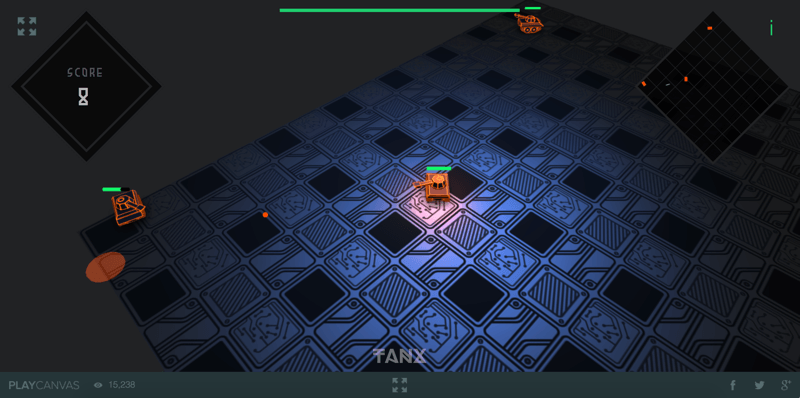

# 

tanx multiplayer WebGL game

[__online demo__](http://playcanv.as/p/aP0oxhUr "tanx game")



# installation & running

```
npm install
node app.js
```

fork [tanx client](https://playcanvas.com/project/45093/overview/tanx) project

change `url` in `client.js`, at `new Socket` to `http://localhost:30043/socket`

then run your game  
